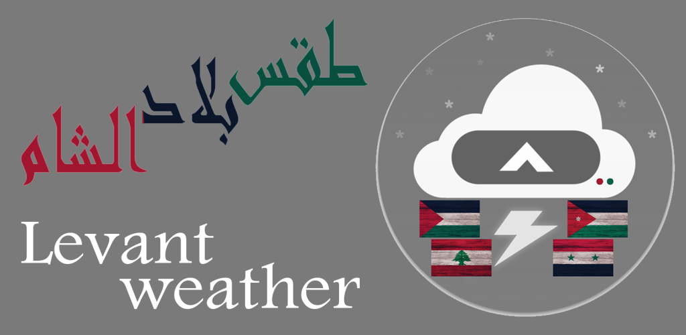
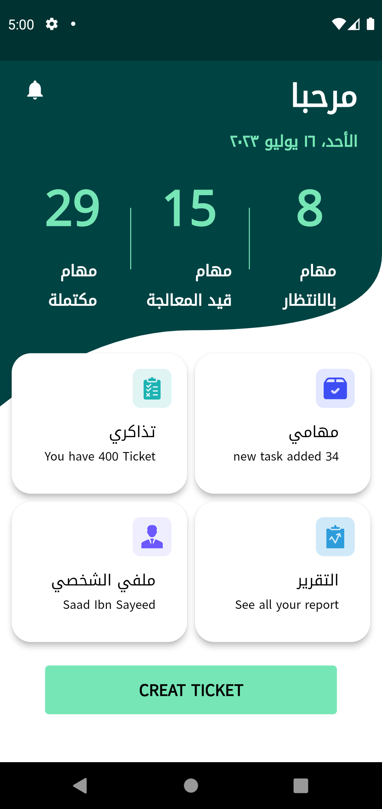
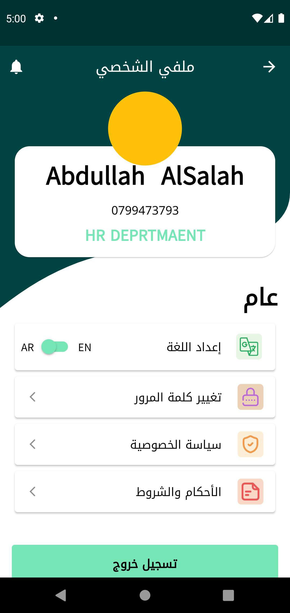
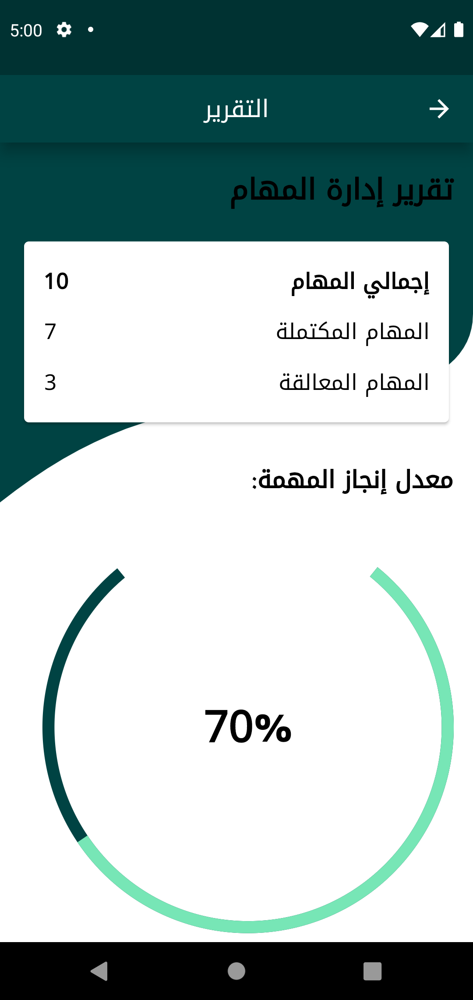
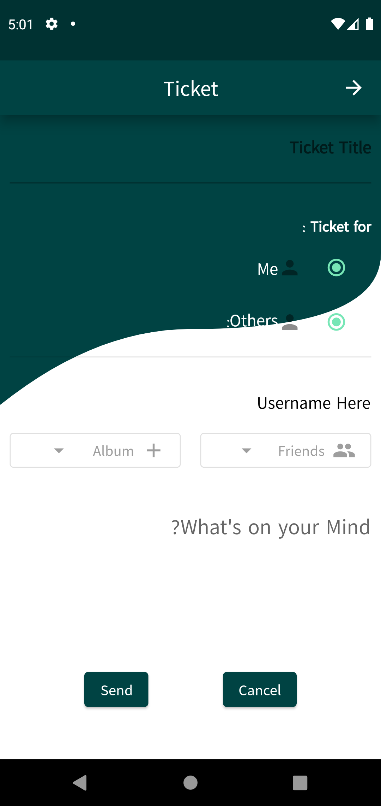
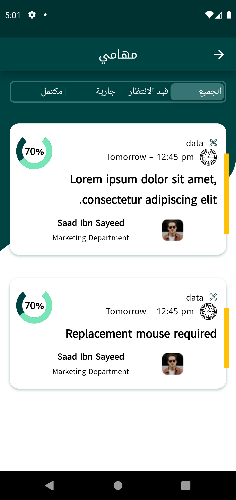
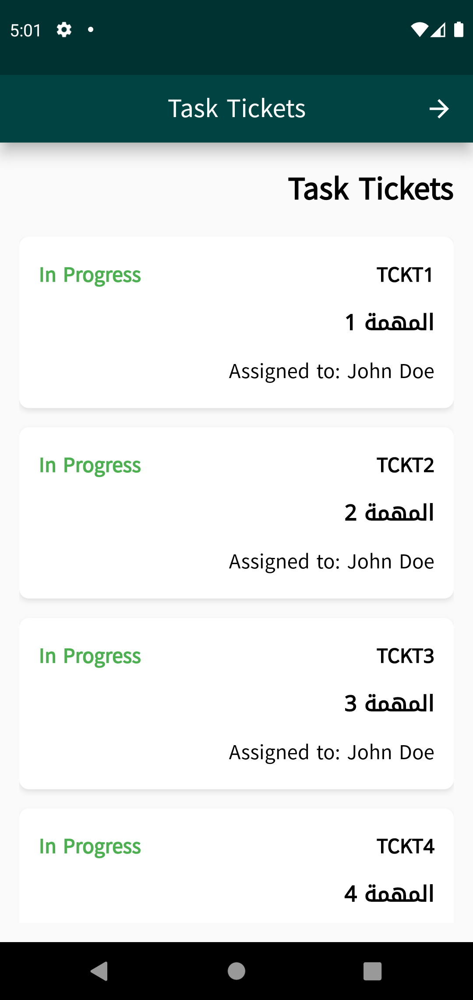

 

  

<h3 align="center">Task manager layout</h3>

  

  task manager layout just a design made for task manager application (i may make an application in future)
     
    <a href="https://github.com/AbdullahAlSalah-SE/flutter_task_manager_layout"><strong>Explore the docs »</strong></a>
     
     
    <a href="https://github.com/AbdullahAlSalah-SE/flutter_task_manager_layout">View Demo</a>
    ·
    <a href="https://github.com/AbdullahAlSalah-SE/flutter_task_manager_layout">Report Bug</a>
    ·
    <a href="https://github.com/AbdullahAlSalah-SE/flutter_task_manager_layout">Request Feature</a>
  

layout for task manager app

     

<b>لاي اوت ل تطبيق مدير المهمام  </b>

## Benfit👻
- [🖥] # Screens 🖥
- [🆗]  HomeScreen
- [🆗]  Profile
- [🆗]  TaskScreen
- [🆗]  TicketScreen
- [🆗]  CreatTicketScreen
- [🆗]  ReportsScreen
--------------------------------
- [🖥] # Deal With 🖥
- [x] Deal With Shared Prefs

------------------------------

## Snapshots

| Home Screen                                      |   Profile Screen                      |
|--------------------------------------------------|---------------------------------------|
||  |

| Reports Screen                                           | Create Tickect Screen         |
|--------------------------------------------------|---------------------------------------|
|       |  |

| Tasks Screen                                           | Task Tickect Screen         |
|--------------------------------------------------|---------------------------------------|
|       |  |